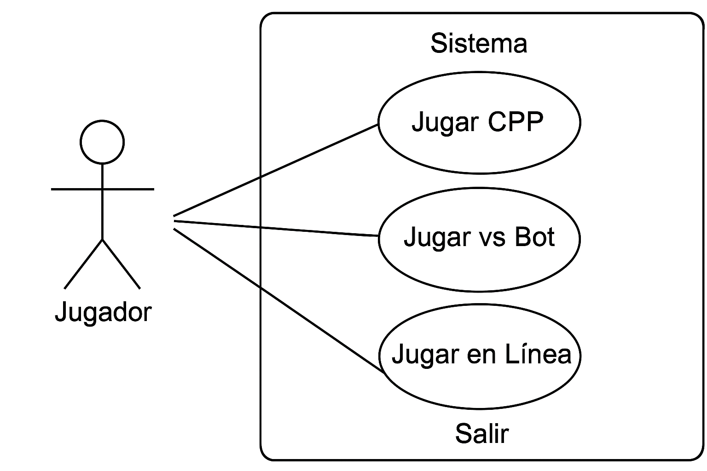
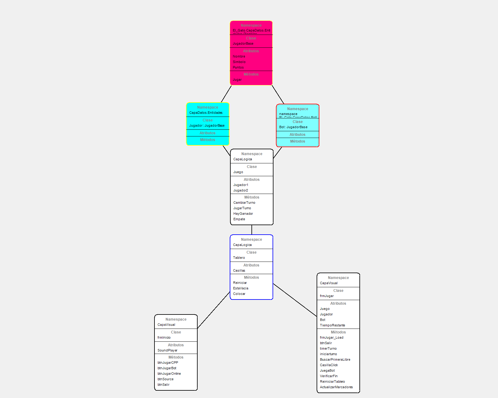
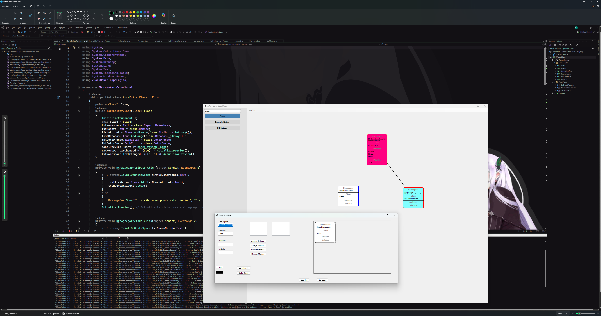

# 📘 Documentación del Proyecto – Tic Tac Toe (El Gato)

**Autor:** ZORRODEV  
**Materia:** Programación Dinámica – UAS  
**Fecha:** 27 de octubre de 2025  
**Versión:** Final con mejoras

---

## 🧠 Descripción General

Este proyecto implementa el clásico juego *Tic Tac Toe* (El Gato) en C++, con soporte para dos jugadores humanos o contra CPU. El código está modularizado, validado y enriquecido con mejoras visuales como colores en consola, hora del sistema y lógica básica para el modo CPU.

---

## 🧩 Estructura del Proyecto
/El_Gato └── elGato.cpp /documentación ├── README.md ├── diagrama_uso.png ├── captura_juego.png └── clases_zDokuMaker.png

---

## 🛠️ Herramientas Utilizadas

- **Visual Studio 2022** para desarrollo y compilación.
- **zDokuMaker**: herramienta propia desarrollada por ZORRODEV para diagramar clases y generar documentación técnica automatizada.
- **GitHub** para control de versiones y entrega reproducible.

---

## 📊 Diagramas Técnicos

### 🎮 Casos de uso de El_Gato + elGato c++

### 📌 Diagrama de clases

### 🧱 Diagrama de clases generado con zDokuMaker

> Las clases del proyecto fueron diagramadas utilizando **zDokuMaker**, una herramienta desarrollada por el autor para automatizar la documentación técnica de proyectos académicos.  
> Este diagrama refleja la estructura modular del código, incluyendo funciones, constantes y tipos definidos.

---

## ▶️ Instrucciones de Ejecución

1. Abrir `elGato.cpp` en Visual Studio o cualquier IDE compatible con C++.
2. Compilar y ejecutar el proyecto.
3. Elegir modo de juego desde el menú:
   - `1`: Jugar entre dos jugadores
   - `2`: Jugar contra CPU
   - `3`: Salir
4. Ingresar coordenadas como `fila columna` (ej. `1 2`).
5. Al finalizar, elegir si deseas jugar de nuevo.

---

## ✅ Criterios Académicos Cubiertos

- [x] Juego funcional entre dos jugadores
- [x] Detección de ganador y empate
- [x] Validación de entradas
- [x] Uso de funciones, arreglos y estructuras de control
- [x] Código legible y comentado
- [x] Mejoras opcionales: colores, hora, modo vs CPU
- [x] Documentación clara y estructurada
- [x] Diagramación técnica con herramienta propia

---

## 📌 Notas Finales

Este proyecto fue desarrollado con enfoque en la reproducibilidad, claridad técnica y presentación profesional. La documentación fue generada y organizada utilizando herramientas propias para garantizar una entrega académica de alto nivel.
