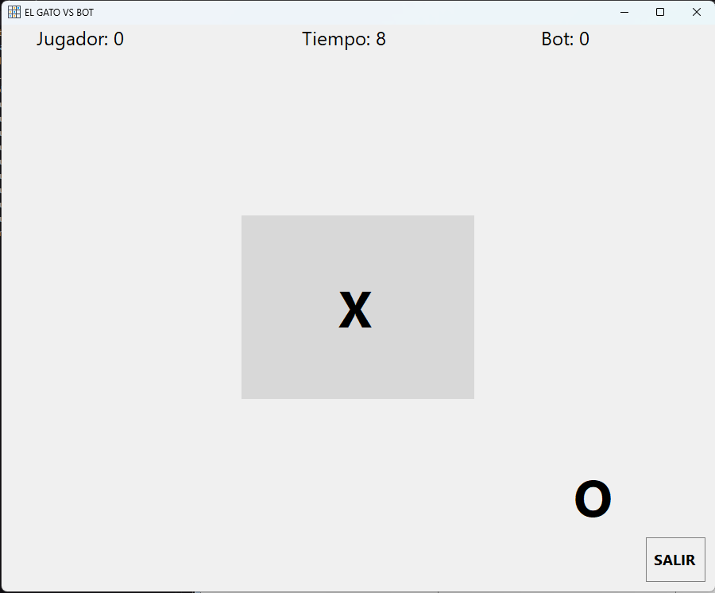
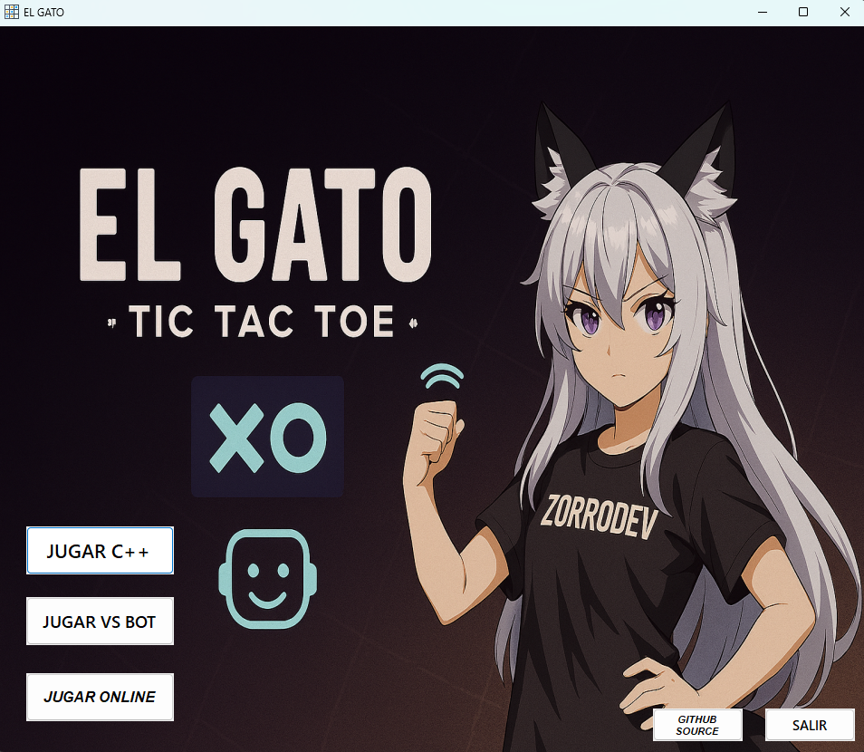

# 🎮 El Gato (C# + C++)

Proyecto académico de **Programación Dinámica**  
Universidad Autónoma de Sinaloa – Los Mochis  
Autor: **Christopher Díaz Gastélum (ZorroDev)**

---

## 📖 Descripción
Este repositorio contiene dos implementaciones del clásico juego **El Gato (Tic Tac Toe)**:
- **Versión en C# (WinForms)** con interfaz gráfica.
- **Versión en C++ (consola)** para ejecución directa.

El proyecto está diseñado para ser reproducible y fácil de compilar en cualquier máquina.

---

## 🖼️ Capturas

---

## ⚙️ Requisitos
- Visual Studio 2022 o superior
- .NET 8.0 (para la versión C#)
- Compilador MSVC (para la versión C++)

---

## 🚀 Instrucciones rápidas
1. Clonar el repositorio.
2. Abrir `El_Gato.sln` en Visual Studio.
3. Compilar la solución completa (**primero se compila el C++ y luego el C#**).
   - Si el ejecutable C++ no se copia automáticamente, compilar manualmente el proyecto `elGato` y luego ejecutar desde el formulario.
4. Presionar **F5** y jugar.

---

## 🖥️ Notas de diseño
- El formulario fue diseñado en un monitor **55" 4K**, pero se configuraron **anchors** para adaptarse a pantallas más pequeñas.
- Si algo no se ajusta bien, los usuarios pueden editar el diseñador.

---

## 🤝 Contribuciones
Este es un proyecto **open source público**.  
Cualquiera puede subir commits, pero todas las contribuciones pasarán por el líder del proyecto: **ZorroDev**.

---
